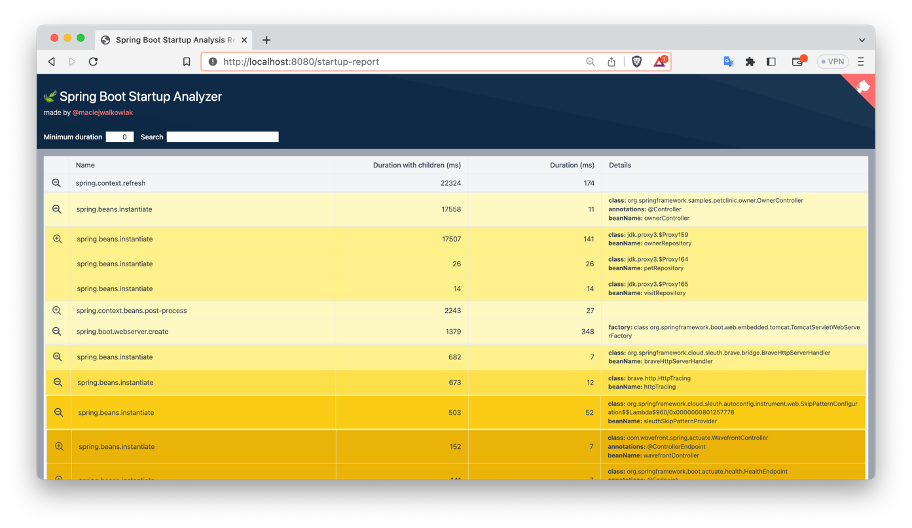
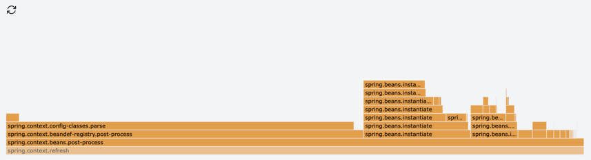

# Spring Boot Startup Report

**Spring Boot Startup Report** library generates an interactive Spring Boot application startup report that lets you understand 
what contributes to the application startup time and perhaps helps to optimize it.

[](https://gitpod.io/#https://github.com/maciejwalkowiak/spring-boot-startup-report)


## 🤩 Highlights

- startup report available in runtime as an interactive HTML page
- generating startup reports in integration tests
- flame chart
- search by class or an annotation

Report table lets you dig into the details of beans instantiation:



Flame graphs is a more visual representation of the data from the table:



## ⚠️ Minimum Requirements

To use the library your project must use following versions

- Java 11 (from `0.2.0` it will run with Java 8)
- Spring Boot 2.7+, 3.0+

## ✨ How to use

> **Note** 
> The report generation depends on Jackson present on the classpath. If you already have `spring-boot-starter-web` or `spring-boot-starter-json` or any other dependency that brings Jackson - there is nothing to worry about, otherwise make sure to add this to your dependency list:
> ```
> <dependency>
>    <groupId>com.fasterxml.jackson.core</groupId>
>    <artifactId>jackson-databind</artifactId>
>  </dependency>
> ```

1. Add the dependency to `spring-boot-startup-report`:

```xml
<dependency>
    <groupId>com.maciejwalkowiak.spring</groupId>
    <artifactId>spring-boot-startup-report</artifactId>
    <version>0.1.0</version>
    <optional>true</optional>
</dependency>
```

2. Run application.

3. Assuming application runs on port `8080`, go to `http://localhost:8080/startup-report`

> **Note**
> This library has dependencies to `org.springframework:spring-test` and `org.springframework.boot:spring-boot-test` so most likely you don't want to include it to your production build and therefore we use it as an optional dependency.

## Using with integration tests

When library is on the classpath, it also automatically generates startup reports for each application context started during running integration tests (tests annotated with `@SpringBootTest`). 
You'll find them in `target/startup-reports` for Maven projects and in `build/startup-reports` for Gradle.

For integration tests that do not use `@SpringBootTest` but `@WebMvcTest`, `@DataJpaTest` or any other test slice, add `@Import(StartupEventsAutoConfiguration.class)` on the top of the test class to enable generating report.

```java
@Import(StartupEventsAutoConfiguration.class)
@WebMvcTest(OwnerController.class)
public class OwnerControllerTests {
    ...
}
```

If you need only to generate reports for tests, but do not need to have the report available in runtime under an endpoint, you can declare the dependency with a `test` scope:

```xml
<dependency>
    <groupId>com.maciejwalkowiak.spring</groupId>
    <artifactId>spring-boot-startup-report</artifactId>
    <version>0.1.0</version>
    <scope>test</scope>
</dependency>
```

Sounds good? Consider [❤️ Sponsoring](https://github.com/sponsors/maciejwalkowiak) the project! Thank you!
